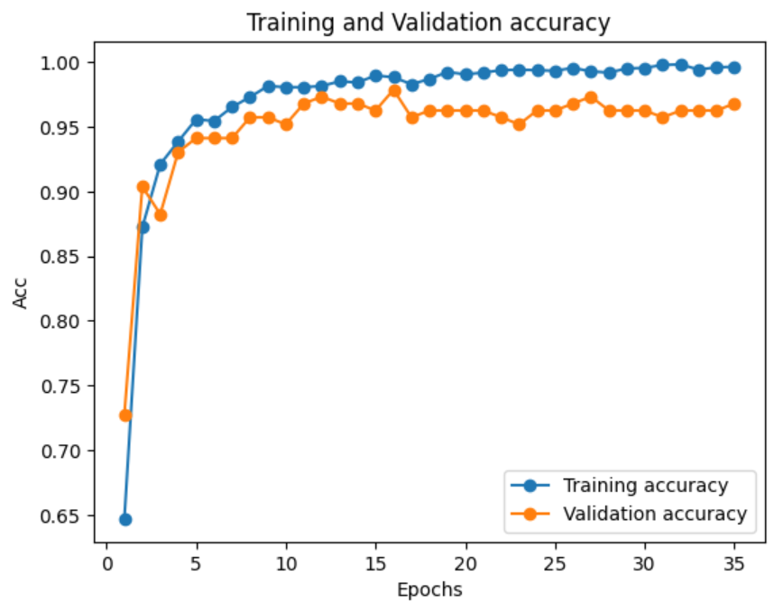
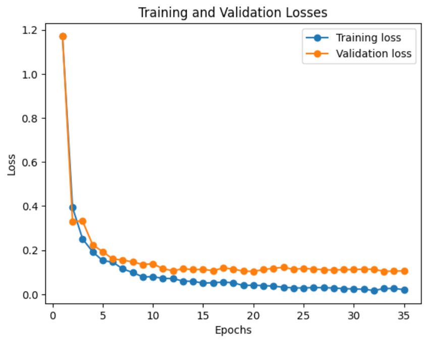
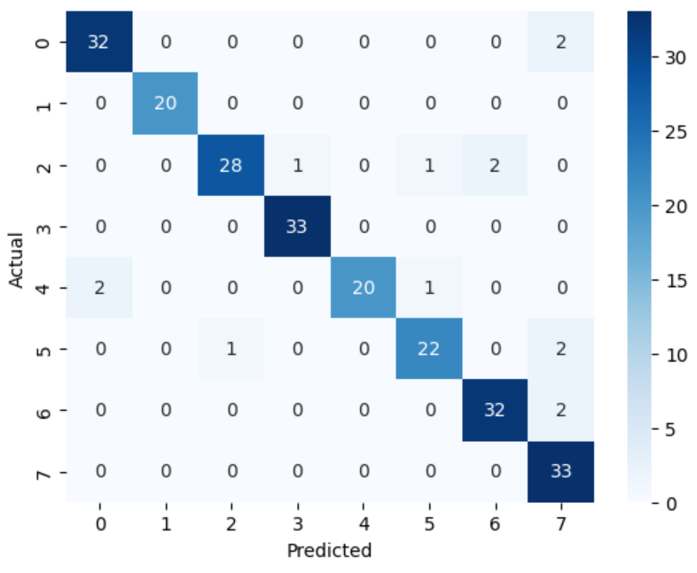

# Skin Disease Prediction

This project builds a deep learning model to classify images of various skin diseases using a Convolutional Neural Network based on EfficientNetB0. The goal is to assist in medical image classification through robust deep learning techniques.

---

## 📊 Dataset

- **Source**: [Skin Disease Dataset on Kaggle](https://www.kaggle.com/datasets/subirbiswas19/skin-disease-dataset)
- **Classes**: Multiple skin disease categories such as eczema, psoriasis, acne, etc. (number of classes-8)
- **Format**: Images organized into folders per disease class

---

## 🔄 Data Preprocessing

- Images are standardized using `EfficientNetB0`'s `preprocess_input()` method.
- Labels are transformed using `LabelEncoder` and then one-hot encoded using `to_categorical`.
- Dataset split into training and validation sets using `train_test_split` with stratification to maintain class balance.
- Data Augmentation: A range of augmentation techniques (e.g., rotation, shift, flip, zoom) are applied to improve model generalization and handle variations in real-world images.

---

## ⚙️ Model Configuration

- **Architecture**: EfficientNetB0 (transfer learning)
- **Optimizer**: Adam
- **Loss Function**: Categorical Crossentropy
- **Epochs**: 100 (early stopped at 35)
- **Batch Size**: 128
- **Callbacks**:
  - `EarlyStopping`: Patience = 15, monitors `val_loss`
  - `ModelCheckpoint`: Saves the best model (`best_model_EfficientNetB0.h5`) based on lowest validation loss

---

## ⏹️ Early Stopping

Training was stopped at **epoch 35** as **validation loss** did not improve from `0.10389`, helping prevent overfitting.

---

## 📈 Model Performance

### ✅ Final Evaluation Metrics:

| Metric        | Score   |
|---------------|---------|
| **Accuracy**  | 94.02%  |
| **Precision** | 94.34%  |
| **Recall**    | 94.02%  |
| **F1 Score**  | 94.01%  |

---

### 📈 Accuracy Graph

### 📉 Loss Graph

### 🧩 Confusion Matrix

### 🧑‍💻 Training and Validation Metrics

| Epochs | Training Accuracy | Validation Accuracy | Training Loss | Validation Loss |
|--------|-------------------|---------------------|---------------|-----------------|
| 35     | 99.92%            | 94.02%              | 0.0008        | 0.1039          |

> 📌 Note: Model shows excellent generalization with minimal overfitting. Further analysis of the confusion matrix can help identify if any specific classes need improvement

---
